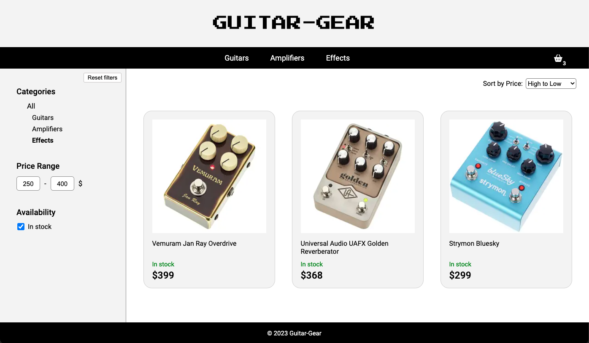

# Music Store

[Check live!](ulr)

Online store with guitar gear built in React.

## Features

- Browse and filter products by:
  - category
  - price range
  - availability
- Sort by price
- Add to basket from product page
- Modify quantity or remove products from the basket
- Check total value

## Technologies

- React
- Jest
- Javascript
- SCSS

## Skills practiced

- React app architecture
- React testing with Jest
- Static and dynamic Routing
- Web app design

## Acknowledgments

- This project was an assignment from The Odin Project course: [Shopping Cart](https://www.theodinproject.com/lessons/node-path-javascript-shopping-cart)
- Design inspirations:
  1. https://www.thomannmusic.com/
  2. https://www.fender.com/
  3. https://allegro.pl/
